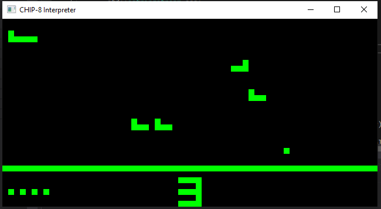

# chip-8-cpp
CHIP-8 interpreter implemented in C++

Using SFML to handle Windows and IO. Rendering is from Chip8 1bpp buffer to SFML 8bpp RGBA buffer.

Project creates a command line tool that takes one input, path to Chip8 ROM.

ROMS can be found on github or other CHIP8 related sites.
